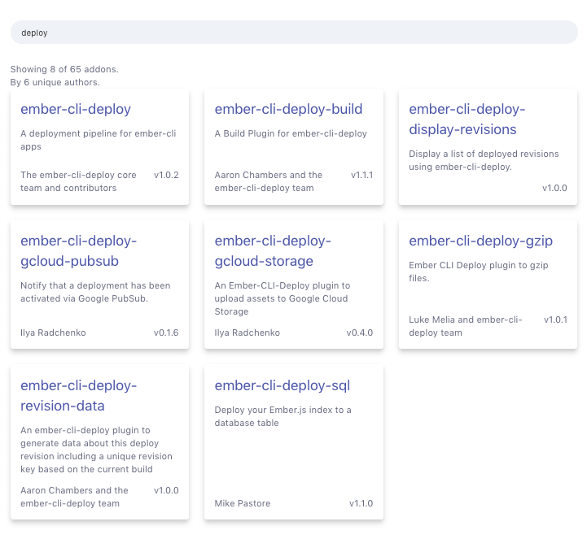

ember-addon-viewer
==================

View information about addons used in your app.

;

Demo here: https://ember-addon-viewer.netlify.com/addon-viewer


Compatibility
------------------------------------------------------------------------------

* Ember.js v3.4 or above
* Ember CLI v2.13 or above
* Node.js v8 or above


Installation
------------

```sh
ember install ember-addon-viewer
```

Usage
-----

Install this addon and visit `/addon-viewer` to see the UI.
This addon is not included in production builds.

### Configuration

By default the viewer is included if not building for production, but you
can override that by setting the following configuration in `config/environment.js`.

```js
ENV['ember-addon-viewer'] = {
  shouldIncludeViewer: true
};
```


Contributing
------------

See the [Contributing](CONTRIBUTING.md) guide for details.


License
------------------------------------------------------------------------------

This project is licensed under the [MIT License](LICENSE.md).
